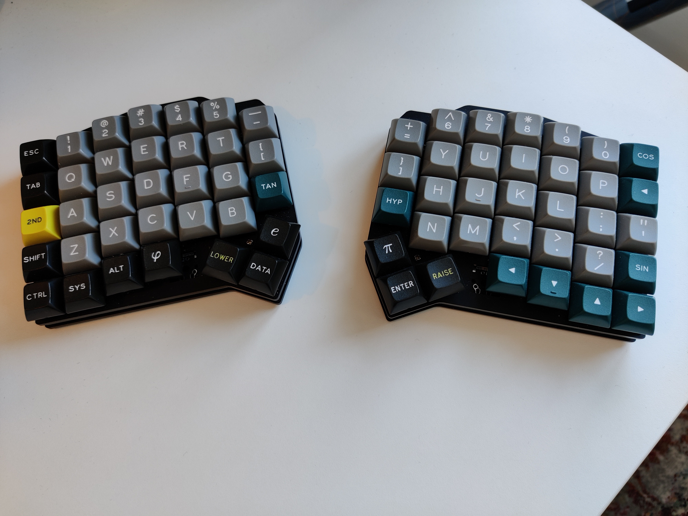
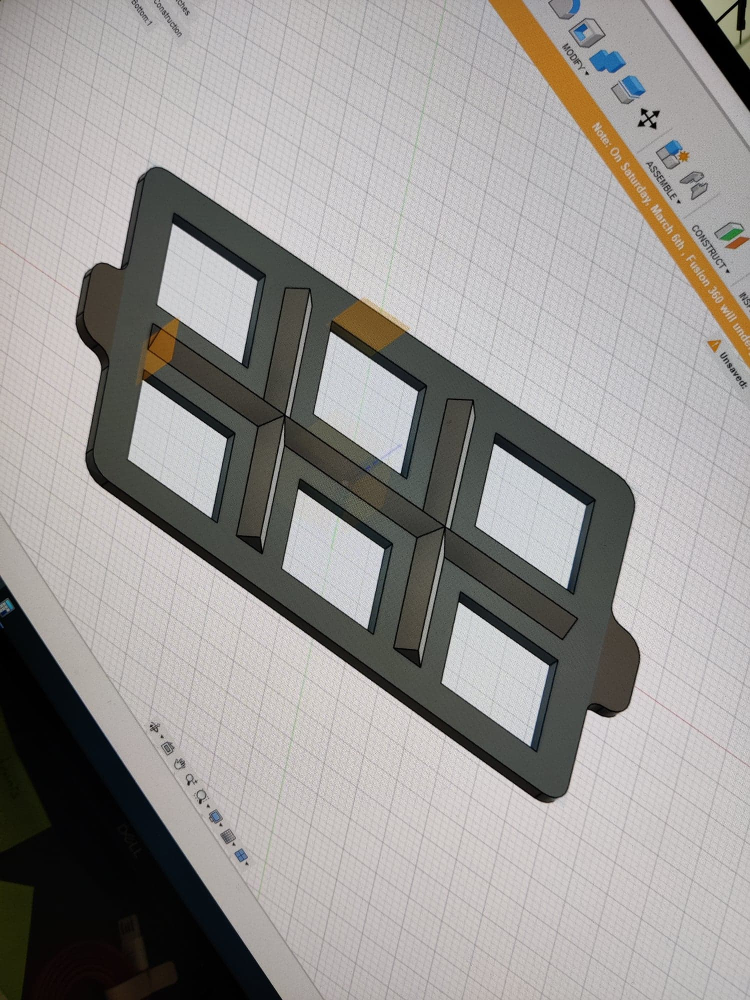
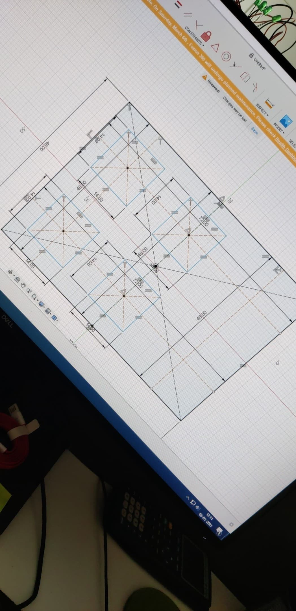
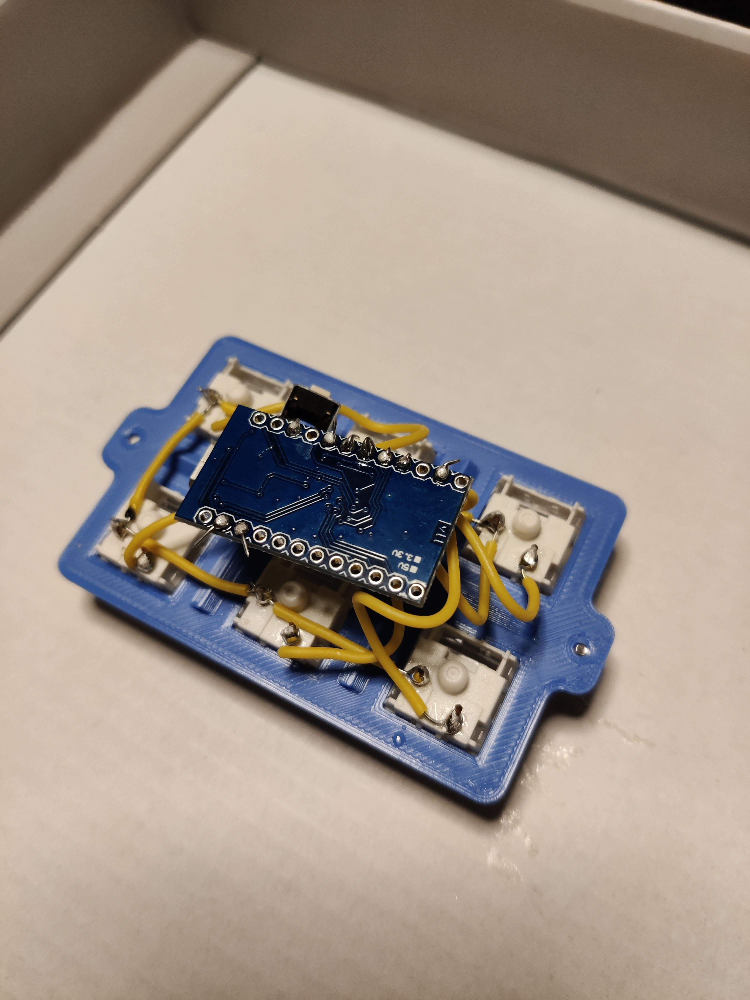
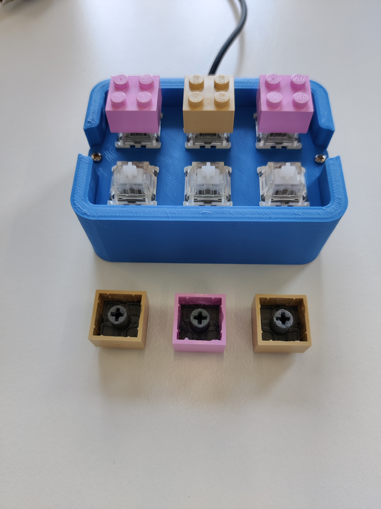
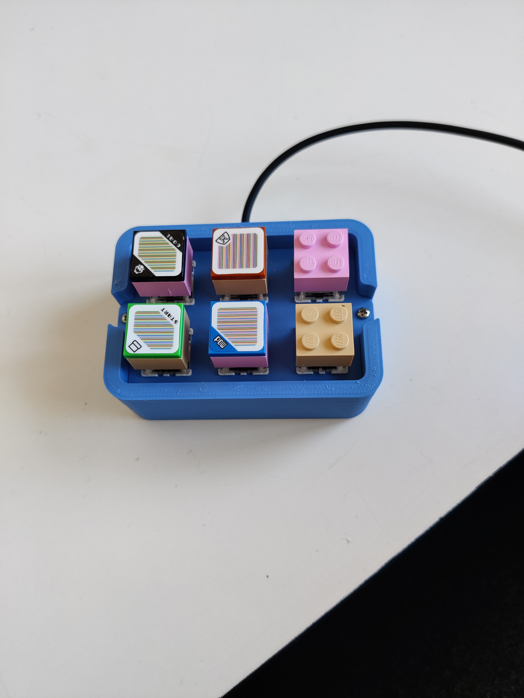

## The Past

I love mechanical keyboards. I frequent `r/mechanicalkeyboards` and `#mechboards`. I probably have a few keyboards too many (as if).

I started out by buying a Coolermaster Quickfire Rapid-i with brown switches. Going from a regular keyboard to a mechanical was like a dream come true. I dream that I didn't even know I had. A few years ago I started getting into electronics and soldering. I bought a few mechanical keyboard kits. After that I have created a few open source keyboards - people giving away their hard work by putting the design files freely available on Github. My latest keyboard is an [ErgoDash](https://github.com/omkbd/ErgoDash/) - a nice split keyboard with lots of features.

## Now

I recently purchased a 3D printer. A Prusa i3 MK3S+. I never thought I would own a 3D printer, but here we are. It seems like an excellent printer with nice support from the official slicer software. I found that Fusion 360 is pretty easy to learn for people who have never done 3D modelling before. I wanted to create a small macro pad for 2x2 LEGO bricks. I also wanted the possibility to build bricks on top of multiple keys, so I needed to design a keyboard where the keys had the correct distance between them. I went to the drawing board:

 

When I had printed the top and bottom of the new keyboard, I started soldering. For most of my own keyboards I have used the Pro Micro. It's a cheap and well tested dev board which does the job! I had never handwired a keyboard before, so that was a fun experience. I am using [QMK](https://beta.docs.qmk.fm/) for the firmware on the Pro Micro and I had to figure out how to create my own keyboard and layout. I used the `DIRECT_PINS` mode because I have so few keys on my board that I do not need to create a matrix.

 

Once assembled and flashed, it was time to test. It works fine. Now I just need to find a purpose for it. It looks fine and I imagine that it can be used a gimmick keyboard.

 

## The Future

It's fun to design your own keyboard. I had never thought I would do it. But now that I have done it, I want to make more. And I want to make bigger keyboards. Maybe even keyboards with the entire alphabet on them. The only limitation I have right now is the printing surface on the Prusa printer.
